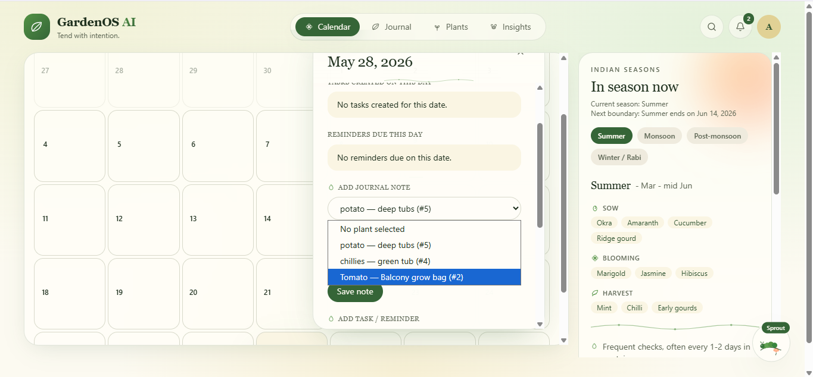
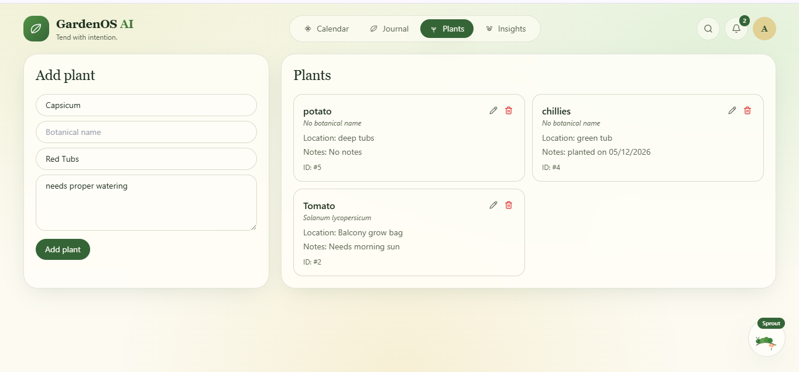
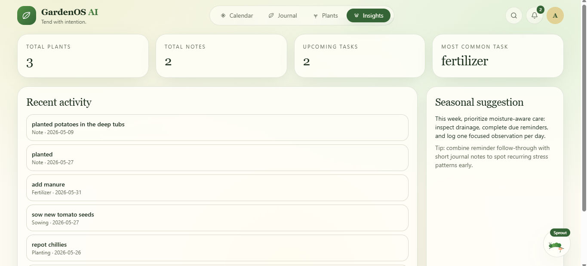
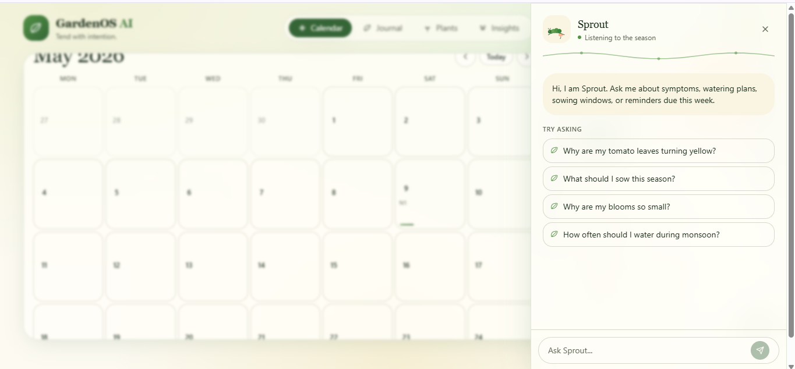
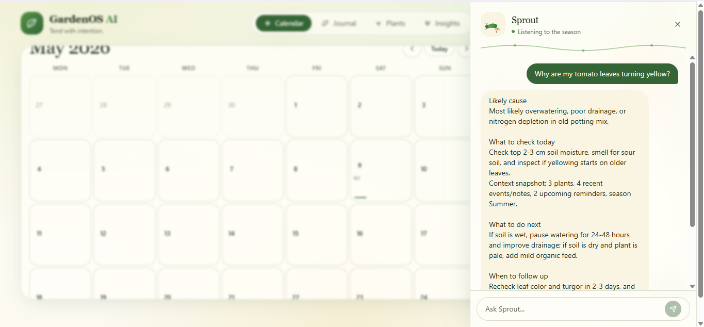

# GardenOS AI

AI-powered gardening memory and advisory platform designed for Indian home gardeners.

GardenOS AI combines modern AI workflows, structured plant tracking, and RAG-ready architecture to help users manage gardening activities, monitor plant health, and access contextual gardening insights through an intelligent assistant.

The platform is built using a scalable full-stack architecture with FastAPI, Next.js, PostgreSQL, ChromaDB, and Docker-based local development.

---

# Features

* AI-powered gardening assistant
* Plant and garden activity tracking
* Event scheduling and reminders
* RAG-ready architecture for contextual gardening advice
* Modular agent and service layer design
* Dockerized full-stack environment
* REST API-based backend architecture
* ChromaDB integration for future semantic retrieval workflows

---

# Tech Stack

## Backend

* FastAPI
* Python 3.11
* SQLAlchemy
* Alembic
* PostgreSQL

## Frontend

* Next.js
* TypeScript
* Tailwind CSS

## AI & Data

* OpenAI-compatible LLM client
* ChromaDB
* Retrieval-Augmented Generation (RAG) ready structure

## DevOps

* Docker
* Docker Compose

---

# Architecture Overview

```text
Frontend (Next.js)
        ↓
FastAPI Backend
        ↓
Service Layer / Agents
        ↓
PostgreSQL + ChromaDB
        ↓
LLM & RAG Pipelines
```

---

# Repository Structure

```text
backend/
  app/
    api/
    agents/
    services/
    rag/
    models/
    schemas/
    db/
    core/

frontend/
  src/app/

data/
  gardening_knowledge/

docker-compose.yml
```

---

# Current Capabilities

Implemented:

* Plant CRUD APIs
* Garden event management APIs
* FastAPI backend architecture
* PostgreSQL integration
* ChromaDB setup
* Dockerized development environment
* AI service and agent boundaries
* Frontend dashboard foundation
* Health monitoring endpoints

Planned:

* Authentication
* Embedding pipelines
* AI memory workflows
* Personalized gardening recommendations
* Production deployment infrastructure

---

# Local Development

## Start Full Stack

```bash
docker compose up --build
```

## Frontend

http://localhost:3000

## Backend API

http://localhost:8000

## API Docs

http://localhost:8000/docs

## ChromaDB

http://localhost:8001

# Product Preview

## Dashboard Overview

The platform includes a centralized gardening dashboard for tracking plants, notes, reminders, seasonal insights, and recent activity.


---

## Garden Calendar

Interactive gardening calendar for tracking schedules, reminders, tasks, and seasonal activities.

Features:

* Task scheduling
* Reminder tracking
* Journal integration
* Seasonal gardening workflows



---

## Plant Management

Dedicated plant tracking system for maintaining plant details, notes, locations, and activity history.

Features:

* Plant CRUD operations
* Botanical information
* Location tracking
* Plant-specific notes
* Event association



---

## Gardening Journal

Structured journaling workflow for recording plant observations, growth updates, and gardening history.

Features:

* Timeline-based journal entries
* Plant-linked observations
* Editable note history
* Growth tracking workflows


---

## Seasonal Insights System

Context-aware seasonal gardening recommendations tailored for Indian gardening conditions.

Features:

* Seasonal crop recommendations
* Blooming guidance
* Harvest tracking
* Weather-aware workflows
* Seasonal reminders



---

## AI Gardening Assistant – Sprout

Integrated AI assistant designed to provide contextual gardening recommendations using conversational workflows and future RAG-ready architecture.

Capabilities:

* Plant care recommendations
* Symptom-based guidance
* Seasonal advice
* Watering recommendations
* Context-aware gardening support



---

## Contextual AI Recommendations

The assistant generates structured gardening guidance using contextual plant data, reminders, seasonal information, and gardening memory workflows.

Example capabilities:

* Plant health diagnosis
* Watering optimization
* Seasonal planning
* Soil and nutrient recommendations



```
```
